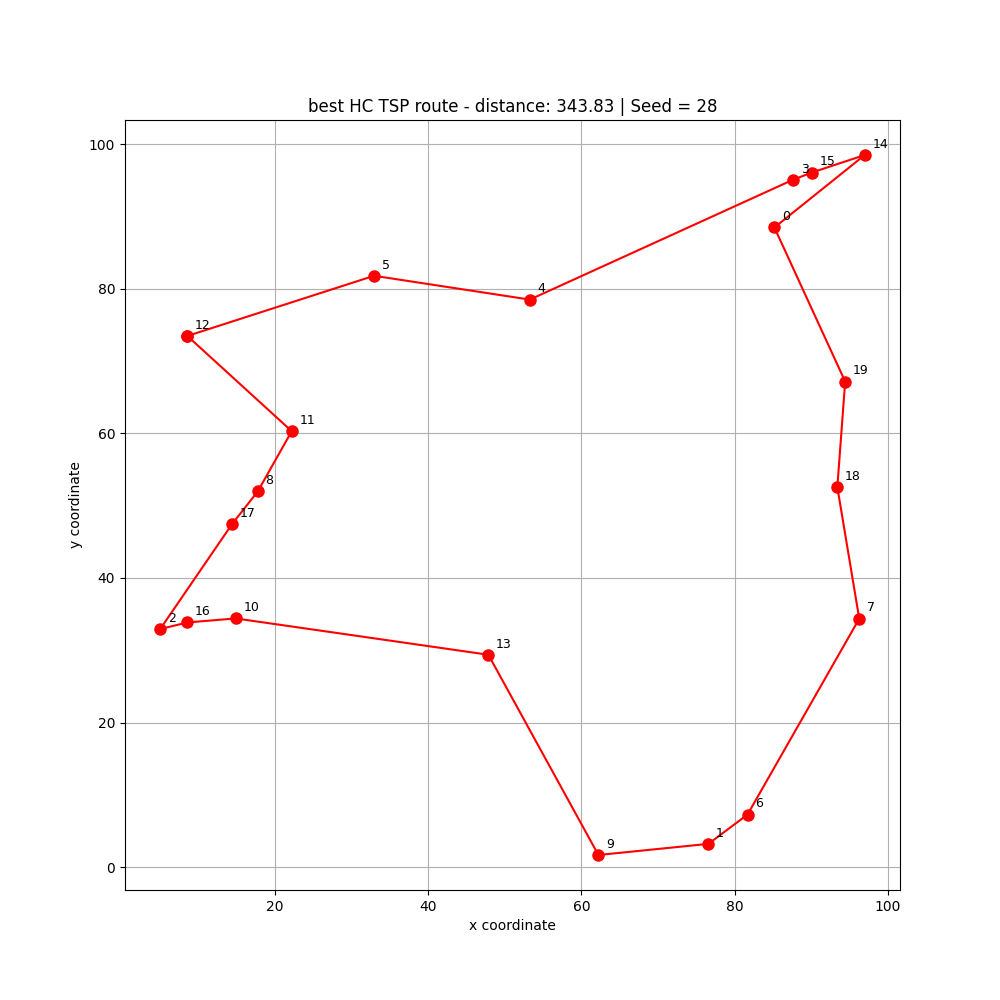
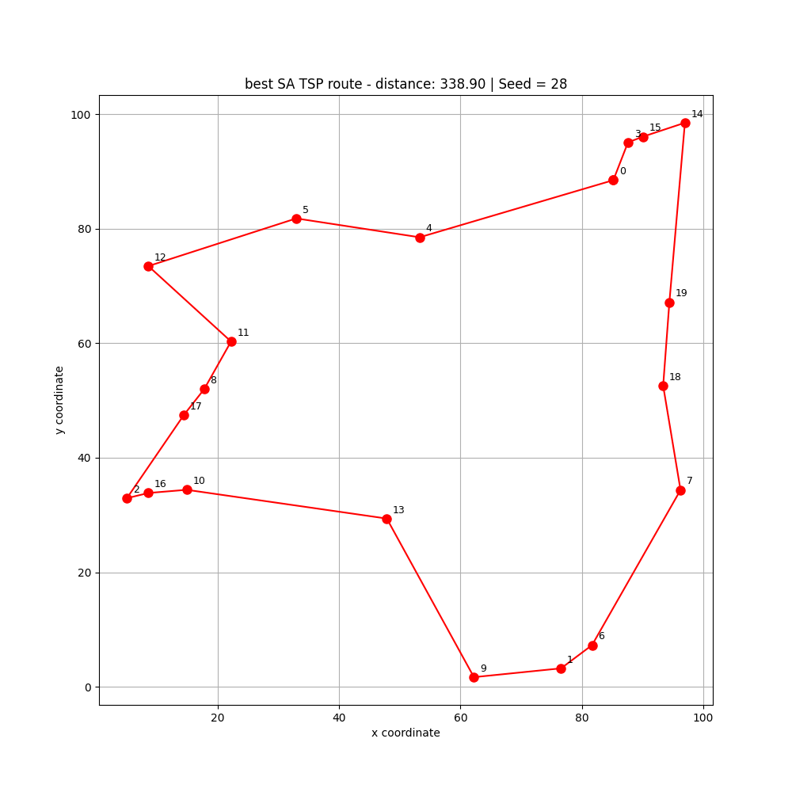
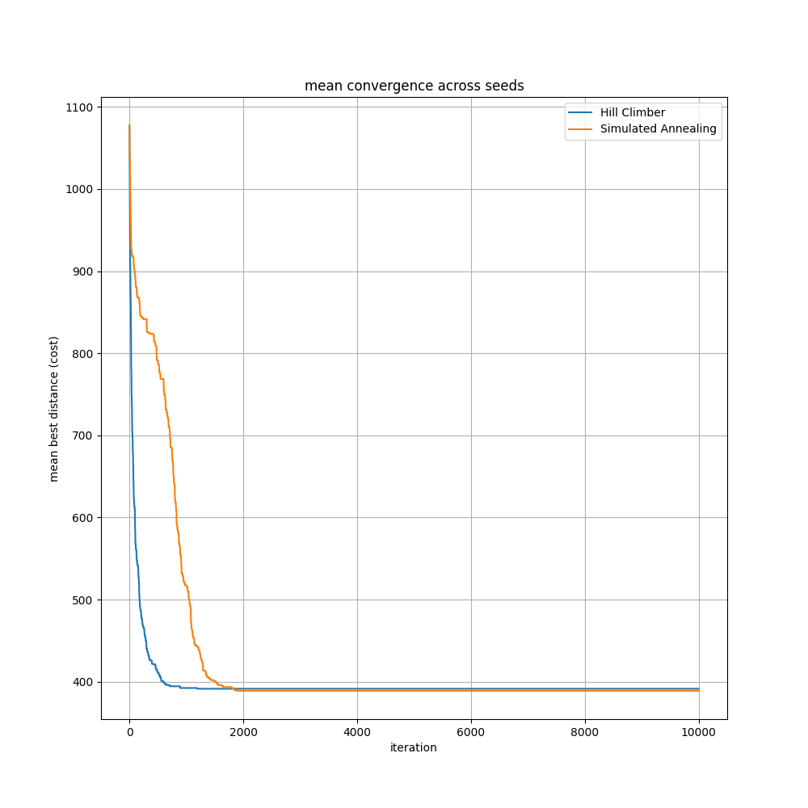

# Current Features

## Travelling Salesman Problem (TSP)

The framework currently includes an implementation of the Travelling Salesman Problem (TSP), where the objective is to determine the shortest possible route that visits every city exactly once before returning to the starting point.

### Implemented Features

- Random TSP instance generation
- Closed-tour distance evaluation
- Feasibility checking
- Route visualisation
- Multi-seed experimentation
- Statistical benchmarking
- CSV result logging
- Convergence tracking

---

## Implemented Algorithms

### Hill Climbing

A greedy local-search optimiser supporting multiple neighbourhood operators.

#### Supported Neighbourhood Operators
- Swap neighbourhood
- 2-opt neighbourhood

The 2-opt implementation significantly improves route quality by removing inefficient route crossings.

---

### Simulated Annealing

A probabilistic optimisation algorithm capable of escaping local optima through controlled acceptance of worse solutions.

Implemented features include:
- Configurable temperature schedules
- Exponential cooling
- Multi-seed benchmarking
- Comparative convergence analysis

---

# Example Results

## Initial TSP Route

The randomly generated initial route contains multiple inefficient crossings and traversal patterns.

---

## Best Hill Climbing Route

Best-performing hill climbing solution obtained across multiple benchmark seeds.

---

## Best Simulated Annealing Route

Best-performing simulated annealing solution obtained across multiple benchmark seeds.

---

## Mean Convergence Comparison

Mean convergence behaviour across multiple seeds comparing Hill Climbing and Simulated Annealing.

This demonstrates:
- Hill Climbing converging rapidly early
- Simulated Annealing exploring more broadly
- Simulated Annealing achieving slightly better average solution quality

---

# Statistical Benchmarking

Experiments are automatically executed across multiple seeds to evaluate:
- robustness
- convergence behaviour
- optimisation stability
- comparative solution quality

Results are automatically persisted to CSV files for later analysis.

Example metrics:
- Mean best cost
- Standard deviation
- Best/worst run performance