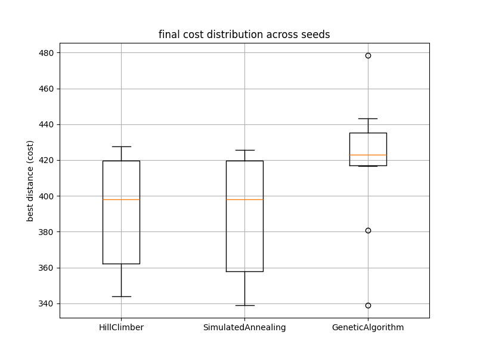
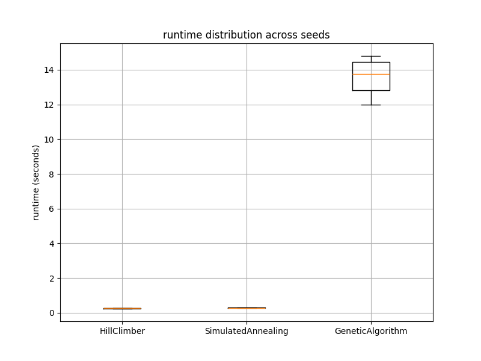
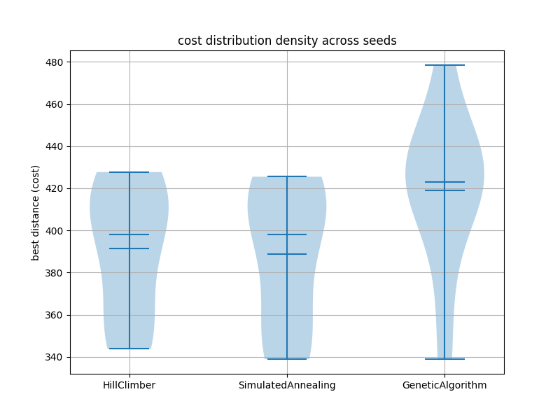
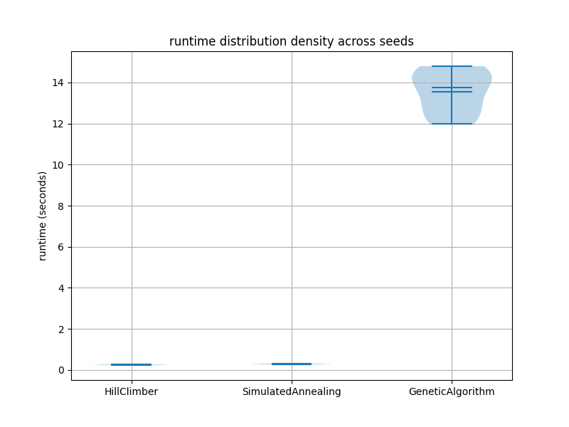

# Metaheuristic Benchmark Suite

A modular optimisation benchmarking framework implemented in Python for experimenting with and evaluating metaheuristic optimisation algorithms on combinatorial optimisation problems.

The project currently focuses on the Travelling Salesman Problem (TSP), while providing a scalable framework architecture for integrating additional optimisation problems and algorithms in the future.

---

# Current Features

## Travelling Salesman Problem (TSP)

The framework currently includes an implementation of the Travelling Salesman Problem (TSP), where the objective is to determine the shortest possible route that visits every city exactly once before returning to the starting point.

### Implemented Features

- Random TSP instance generation
- Closed-tour distance evaluation
- Feasibility checking
- Route visualisation
- Multi-seed experimentation
- Statistical benchmarking
- CSV result logging
- Runtime benchmarking
- Mean convergence analysis
- Box plot and violin plot statistical visualisations
- Configurable experiment execution pipeline
- Algorithm abstraction system
- Dataclass-based optimisation results

---

# Implemented Algorithms

## Hill Climbing

A greedy local-search optimiser supporting multiple neighbourhood operators.

### Supported Neighbourhood Operators
- Swap neighbourhood
- 2-opt neighbourhood

The 2-opt implementation significantly improves route quality by removing inefficient route crossings and refining local route structure.

---

## Simulated Annealing

A probabilistic optimisation algorithm capable of escaping local optima through controlled acceptance of worse solutions during early exploration phases.

### Implemented Features
- Configurable temperature schedules
- Exponential cooling
- Multi-seed benchmarking
- Comparative convergence analysis
- Runtime analysis

---

## Genetic Algorithm

A population-based evolutionary optimisation algorithm implemented using permutation-based representations for the Travelling Salesman Problem.

### Implemented Features
- Tournament selection
- Ordered crossover (OX)
- Swap mutation
- Elitism
- Adaptive mutation schedules
- Multi-seed benchmarking
- Runtime and convergence analysis

The adaptive mutation strategy dynamically decreases mutation intensity throughout the optimisation process, encouraging stronger exploration during early generations and more refined exploitation during later generations.

---

# Framework Architecture

The project is structured as a modular experimentation framework:

```text
algorithms/
    hill_climber.py
    simulated_annealing.py
    genetic_algorithm.py

core/
    algorithm_config.py
    optimisation_result.py

experiments/
    experiment_runner.py

problems/
    TSPProblem.py

visualisation/
    tsp_plot.py

analysis/
    analyse_results.py

results/
    tsp_results.csv
```

This architecture allows new optimisation algorithms and benchmark problems to be integrated with minimal changes to the experimentation pipeline.

---

# Example Results

## Initial TSP Route

The randomly generated initial route contains multiple inefficient crossings and traversal patterns.


---

## Best Hill Climbing Route

Best-performing Hill Climbing solution obtained across multiple benchmark seeds.


---

## Best Simulated Annealing Route

Best-performing Simulated Annealing solution obtained across multiple benchmark seeds.


---

## Best Genetic Algorithm Route

Best-performing Genetic Algorithm solution obtained across multiple benchmark seeds.


---

## Mean Convergence Comparison

Mean convergence behaviour across multiple benchmark seeds comparing all implemented optimisation algorithms.

The convergence analysis demonstrates differing exploration and exploitation behaviour between local-search and population-based optimisation approaches.


---

## Cost Distribution Box Plots

Distribution of final optimisation costs across multiple benchmark seeds.



---

## Runtime Distribution Box Plots

Distribution of optimisation runtimes across multiple benchmark seeds.



---

## Cost Distribution Violin Plots

Density-based visualisation of optimisation cost distributions across multiple benchmark seeds.



---

## Runtime Distribution Violin Plots

Density-based visualisation of runtime distributions across multiple benchmark seeds.



---

# Statistical Benchmarking

Experiments are automatically executed across multiple random seeds to evaluate:
- robustness
- convergence behaviour
- optimisation stability
- runtime behaviour
- comparative solution quality

Results are automatically persisted to CSV files for later analysis and visualisation.

Current benchmark metrics include:
- Mean best cost
- Standard deviation
- Best/worst solution quality
- Runtime analysis
- Convergence tracking
- Distribution analysis

---

# Current Benchmark Observations

Current experimentation demonstrates:

- Hill Climbing provides extremely strong local refinement performance for small TSP instances when combined with 2-opt neighbourhood operators.
- Simulated Annealing achieves slightly better average solution quality through broader exploration of the search space.
- The Genetic Algorithm demonstrates stronger global exploration capabilities but currently incurs significantly higher computational cost and requires further tuning for competitive performance.

---

# Future Improvements

Planned future work includes:
- Memetic Genetic Algorithms
- Hybrid local-search refinement
- Particle Swarm Optimisation (PSO)
- Additional benchmark optimisation problems
- Parallelised fitness evaluation
- Configuration-driven experiment execution
- Evaluation-budget benchmarking
- Hyperparameter sweep automation

---

# Installation

Clone the repository:

```bash
git clone https://github.com/AlistairMacDiarmid/MetahueristicBenchmarkSuite.git
cd MetahueristicBenchmarkSuite
```

Install dependencies:

```bash
pip install -r requirements.txt
```

# Technologies Used

- Python
- NumPy
- Matplotlib
- Pandas


