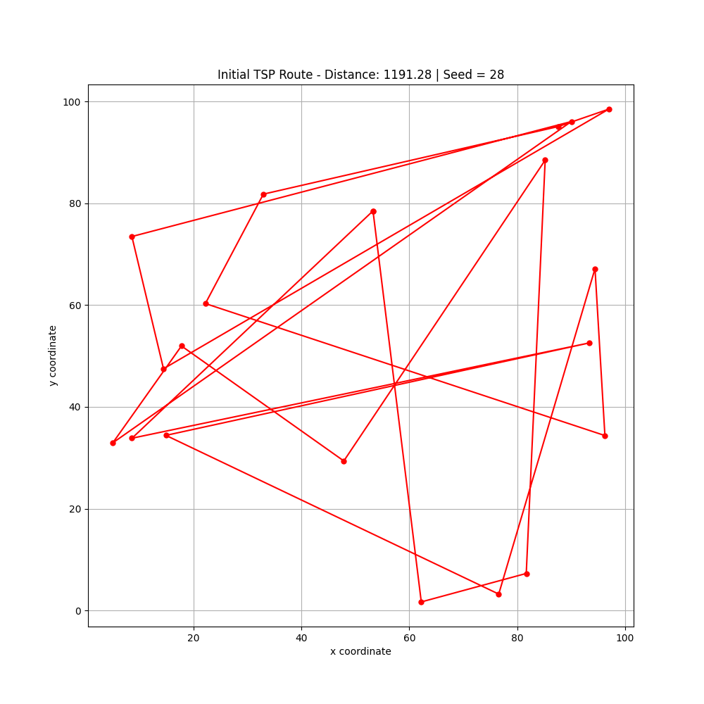
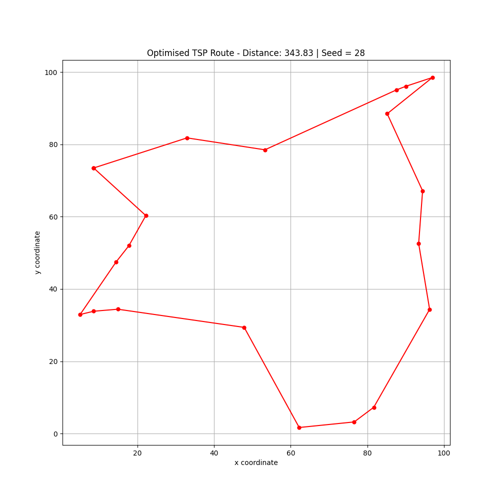
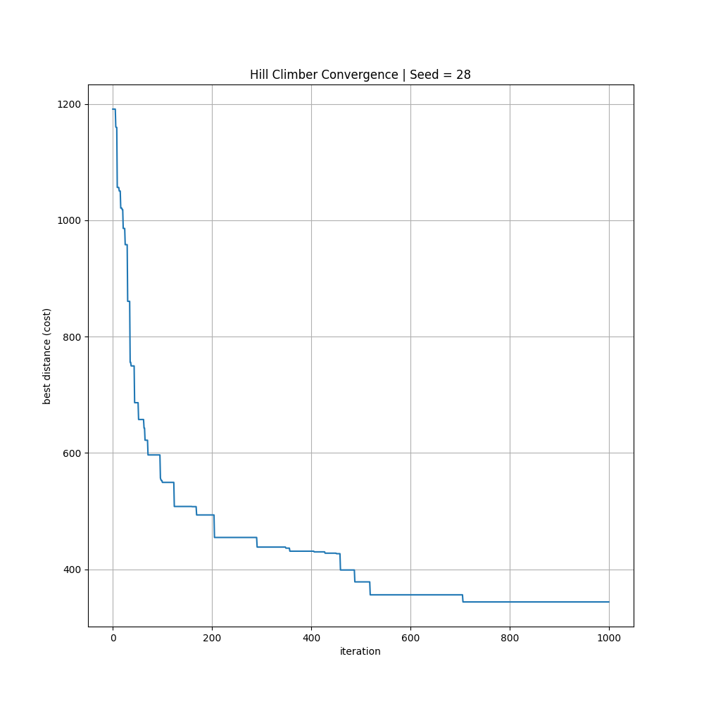

# Metaheuristic Benchmark Suite

A modular Python framework for benchmarking and visualising metaheuristic optimisation algorithms on classical optimisation problems.

The goal of this project is to provide a reusable experimentation environment for analysing optimisation algorithms across multiple benchmark problems, with support for:

- Modular optimisation architectures
- Benchmark problem definitions
- Visualisation of optimisation behaviour
- Convergence analysis
- Algorithm comparison
- Constraint handling
- Experiment reproducibility

---

# Current Features

## Travelling Salesman Problem (TSP)

The framework currently includes an implementation of the Travelling Salesman Problem (TSP), where the objective is to determine the shortest possible route that visits every city exactly once before returning to the starting point.

### Implemented Features

- Random TSP instance generation
- Closed-tour distance evaluation
- Feasibility checking
- Route visualisation
- Convergence tracking

---

## Hill Climbing Optimiser

A modular hill climbing optimiser has been implemented with support for multiple neighbourhood strategies.

### Supported Neighbourhood Operators

#### Swap Neighbourhood
Randomly swaps the position of two cities within the route.

#### 2-opt Neighbourhood
Performs route segment reversal to remove inefficient route crossings and improve convergence quality.

The 2-opt implementation significantly improves route quality compared to naive city swapping.

---

# Example Results

## Initial TSP Route

The randomly generated initial solution contains numerous route crossings and inefficient traversal patterns.

**Configuration:**
- 20 cities
- Seed = 28
- Closed-tour distance evaluation



---

## Optimised TSP Route

After optimisation using hill climbing with the 2-opt neighbourhood operator, the route becomes significantly more spatially coherent and the total route distance is substantially reduced.

**Configuration:**
- Hill Climbing
- 2-opt neighbourhood operator
- 1000 iterations
- Seed = 28



---

## Convergence Behaviour

The convergence curve demonstrates the optimisation process progressively reducing the total route cost over time.



---

# Project Structure

```text
MetaheuristicBenchmarkSuite/
│
├── algorithms/
│   └── hill_climber.py
│
├── problems/
│   └── tsp.py
│
├── visualisation/
│   └── tsp_plot.py
│
├── images/
│   ├── initial_tsp_route.png
│   ├── optimised_tsp_route.png
│   └── tsp_convergence.png
│
├── results/
│
├── main.py
├── requirements.txt
└── README.md
```

---

# Technologies Used

- Python
- NumPy
- matplotlib

---

# Current Optimisation Pipeline

The current optimisation workflow is structured as:

1. Generate a benchmark optimisation problem
2. Generate an initial feasible solution
3. Apply a metaheuristic optimisation algorithm
4. Evaluate solution quality
5. Track convergence metrics
6. Visualise optimisation behaviour

---

# Planned Features

## Additional Algorithms

- Simulated Annealing
- Genetic Algorithms
- Particle Swarm Optimisation
- Differential Evolution
- Tabu Search

---

## Additional Benchmark Problems

- Knapsack Problem
- Job Scheduling
- Vehicle Routing Problem (VRP)
- Continuous Function Optimisation
- Wind Farm Layout Optimisation

---

## Future Improvements

- Statistical benchmarking framework
- Parallel fitness evaluation
- Experiment orchestration system
- CSV result logging
- Interactive dashboards
- Animated optimisation visualisations
- Configuration system
- GPU acceleration

---

# Example Usage

```python
from problems.tsp import TSPProblem
from algorithms.hill_climber import HillClimber

seed = 28

problem = TSPProblem.generate_random(
    num_cities=20,
    seed=seed
)

optimiser = HillClimber(
    max_iterations=1000,
    seed=seed,
    neighbour_strategy="two_opt"
)

result = optimiser.optimise(problem)

print(result["best_cost"])
```

---

# Motivation

This project was created to explore the behaviour, performance, and architectural design of metaheuristic optimisation systems across both constrained and unconstrained optimisation problems.

The framework is designed to prioritise:

- Modularity
- Extensibility
- Reproducibility
- Experimental analysis
- Visual interpretability

---

# License

This project is licensed under the MIT License.

